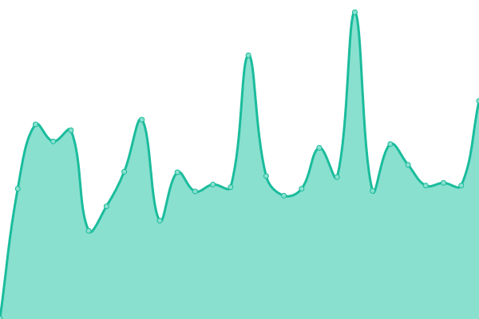
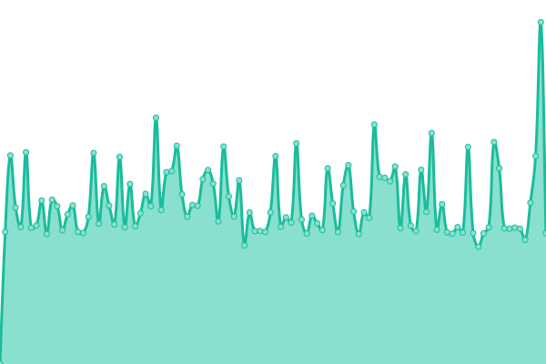

# [📈 Live Status](https://lassewp.github.io/nielsen-upptime): <!--live status--> **🟧 Partial outage**

This repository contains the open-source uptime monitor and status page for [Lasse W. Pedersen](willaume.net), powered by [Upptime](https://github.com/upptime/upptime).

With [Upptime](https://upptime.js.org), you can get your own unlimited and free uptime monitor and status page, powered entirely by a GitHub repository. We use [Issues](https://github.com/lassewp/nielsen-upptime/issues) as incident reports, [Actions](https://github.com/lassewp/nielsen-upptime/actions) as uptime monitors, and [Pages](https://lassewp.github.io/nielsen-upptime) for the status page.

<!--start: status pages-->
<!-- This summary is generated by Upptime (https://github.com/upptime/upptime) -->
<!-- Do not edit this manually, your changes will be overwritten -->
<!-- prettier-ignore -->
| URL | Status | History | Response Time | Uptime |
| --- | ------ | ------- | ------------- | ------ |
|  [Nielsen Tattoo](https://www.nielsentattoo.dk) | 🟩 Up | [nielsen-tattoo.yml](https://github.com/lassewp/nielsen-upptime/commits/HEAD/history/nielsen-tattoo.yml) | 

 336ms
     
 | 

<a href="https://lassewp.github.io/nielsen-upptime/history/nielsen-tattoo">99.50%</a>
    

|  [Gridy](https://www.gridy.dk) | 🟥 Down | [gridy.yml](https://github.com/lassewp/nielsen-upptime/commits/HEAD/history/gridy.yml) | 

 0ms
     
 | 

<a href="https://lassewp.github.io/nielsen-upptime/history/gridy">0.00%</a>
    

|  [Willaume](https://willaume.net) | 🟩 Up | [willaume.yml](https://github.com/lassewp/nielsen-upptime/commits/HEAD/history/willaume.yml) | 

 896ms
     
 | 

<a href="https://lassewp.github.io/nielsen-upptime/history/willaume">91.66%</a>
    

<!--end: status pages-->

[**Visit our status website →**](https://lassewp.github.io/nielsen-upptime)

## 📄 License

- Powered by: [Upptime](https://github.com/upptime/upptime)
- Code: [MIT](./LICENSE) © [Anand Chowdhary](https://anandchowdhary.com), supported by [Pabio](https://pabio.com)
- Data in the `./history` directory: [Open Database License](https://opendatacommons.org/licenses/odbl/1-0/)
